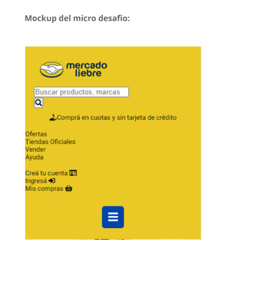
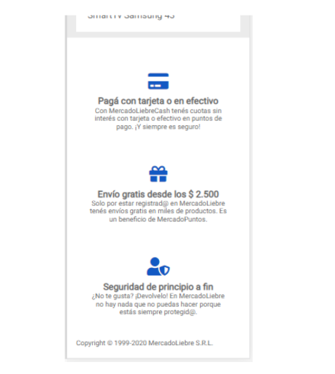
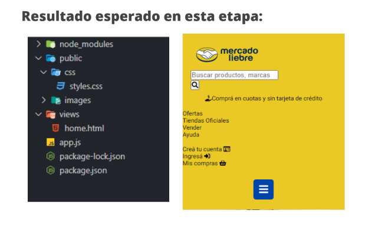

# Trabajo Practico Numero 2 - Mercado Liebre - Agregando Estilos.

*****************************************************************************

## Desafio 1:
### el desafio consiste en aplicarle los estilos que nos envía el departamento de diseño a cada sección del Header del sitio (navbar, login bar y al search bar). Recordemos que por el momento estamos trabajando mobile first.
### Para esto nos facilitó los siguientes estilos generales:
- Paleta de colores:
     - Amarillo: #EAC926;
     - Azul: #03264C;
     - Celeste: #1259c3;
     - Gris oscuro: #666;
     - Gris claro: #ebebeb;
     - Verde: #39b54a;

- Tipografías:
     - Familia: 'Roboto'

- Tamaños Tipográficos:
     - Cuerpos de texto: 12px
     - Titulares (Basado en tu última visita/Ofertas): 24px
     - Precios: 18px
     - Descuentos: 16px
     - Descripciones: 16px     

*************************************************************************************************
- Mockup del desafio:

**************************************************************************************************

## Desafio 2: implementar el último elemento del Header el menú hamburguesa.

## Desafio 3: Agregar estilos al Footer (pie de pagina)

****************************************************************************************************

*****************************************************************************************************

## Resultados Esperados: 

